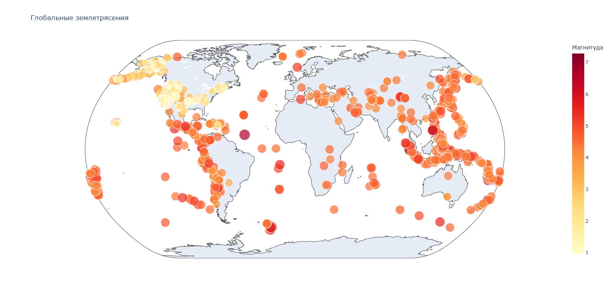
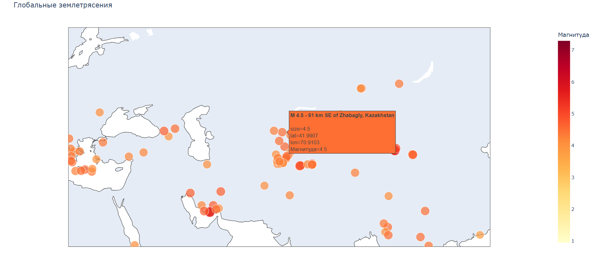

# Создание диаграмм с нуля для поиска самых разрушительных землетрясений по миру

В этом репозитории представлен **код**, который способен выводить готовую **диаграмму землетрясений по всему миру.**

В Интернете нам доступны файлы данных с информацией о последних землетрясениях за 1-часовой, 1-дневный, 7-дневный и 30-дневный периоды.  

К примеру, я брал информацию с этого сайта: [сайт_данных_о_землетрясениях](https://earthquake.usgs.gov/earthquakes/feed/v1.0/geojson.php)

## Как это выглядит?

Допустим, я скачал файлы формата GeoJSON и хочу их извлечь для представления информации о землетрясениях в виде диаграммы.  

Вот как выглядит сама диаграмма:

    

Предположим, что я захочу узнать магнитуду какого-либо землетрясения - мне достаточно просто навести курсор на любую из точек. Пример:

    

**Диаграмма является полностью интерактивной!**